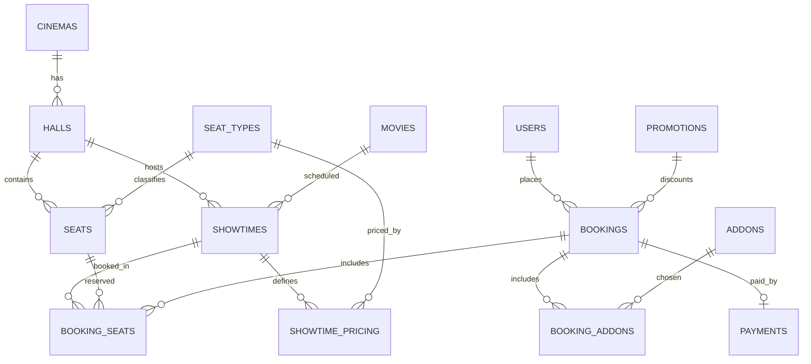

# KorawitCinema — Schema ที่เว็บใช้งานจริงตอนนี้

เอกสารนี้บอก schema ตามโค้ดจริงใน `src/lib/types.ts` และ `src/lib/mock-data.ts` ของเว็บ ณ ตอนนี้ — **ไม่ใช่**฿ 100% ของ `KorawitCinema_schema.md` ต้นฉบับ ส่วนที่ต่างกันมีหมายเหตุกำกับไว้ทุกจุด (ดูสรุปท้ายไฟล์)

ตอนนี้ข้อมูลทั้งหมดยังเป็น mock data ในฝั่ง client (TypeScript object + localStorage ผ่าน Zustand) ยังไม่ได้ต่อ Supabase จริง — SQL ด้านล่างคือ schema ที่ "พร้อมสร้างจริงบน Postgres/Supabase" ให้ตรงกับโค้ดปัจจุบันเป๊ะ ถ้าจะ migrate ไปใช้ฐานข้อมูลจริงสามารถรันตามนี้ได้เลย

---

## ER Diagram (ตามจริงที่ใช้งาน)



หมายเหตุ: `MOVIES` ไม่มี `GENRES`/`MOVIE_GENRES` เป็น junction table จริงในไดอะแกรมนี้ — genre ถูกยัดเป็น array (`genre_ids`) อยู่ในตัว movie เอง (ดูหมายเหตุด้านล่าง)

---

## SQL (พร้อมรันบน Supabase ให้ตรงกับโค้ดปัจจุบัน)

```sql
-- ตอนนี้แอปใช้ id เป็น string ล้วน (สร้างฝั่ง client เช่น "m1", "b-173...")
-- ถ้าต่อ Supabase จริงแนะนำเปลี่ยนเป็น uuid/bigserial แทน แต่ type ด้านล่าง
-- ใช้ TEXT ไว้ก่อนให้ตรงกับ mock data ปัจจุบันเป๊ะๆ

CREATE TYPE user_role AS ENUM ('customer', 'staff', 'admin');
CREATE TYPE member_tier AS ENUM ('basic', 'silver', 'gold');

CREATE TABLE users (
    user_id         TEXT PRIMARY KEY,
    full_name       VARCHAR(150) NOT NULL,
    email           VARCHAR(150) UNIQUE NOT NULL,
    phone           VARCHAR(20),
    role            user_role NOT NULL DEFAULT 'customer',
    member_tier     member_tier NOT NULL DEFAULT 'basic',
    points_balance  INT NOT NULL DEFAULT 0,
    created_at      TIMESTAMPTZ NOT NULL DEFAULT now()
    -- ขาด: password_hash, is_active, updated_at
    -- (auth ตอนนี้เป็น mock เก็บรหัสผ่าน plain text ใน localStorage ฝั่ง client
    --  ยังไม่ได้ใช้ Supabase Auth จริง)
);

CREATE TABLE cinemas (
    cinema_id       TEXT PRIMARY KEY,
    name            VARCHAR(150) NOT NULL,
    address         TEXT,
    city            VARCHAR(100)
    -- ขาด: lat, lng, phone, is_active
);

CREATE TABLE halls (
    hall_id         TEXT PRIMARY KEY,
    cinema_id       TEXT NOT NULL REFERENCES cinemas(cinema_id),
    name            VARCHAR(50) NOT NULL,
    screen_type     VARCHAR(30) NOT NULL DEFAULT 'standard', -- standard/imax/4dx/dolby
    total_rows      INT NOT NULL,
    total_columns   INT NOT NULL,
    UNIQUE (cinema_id, name)
);

CREATE TABLE seat_types (
    seat_type_id     TEXT PRIMARY KEY,
    code             VARCHAR(20) UNIQUE NOT NULL, -- STANDARD / VIP / COUPLE
    label            VARCHAR(50) NOT NULL,
    price_multiplier DECIMAL(4,2) NOT NULL
    -- หมายเหตุ: เว็บนี้มีแค่ 3 ประเภท ตัด RECLINER ออก
);

CREATE TABLE seats (
    seat_id         TEXT PRIMARY KEY,
    hall_id         TEXT NOT NULL REFERENCES halls(hall_id),
    seat_row        VARCHAR(2) NOT NULL,
    seat_column     INT NOT NULL,
    seat_type_id    TEXT NOT NULL REFERENCES seat_types(seat_type_id),
    is_active       BOOLEAN NOT NULL DEFAULT TRUE,
    UNIQUE (hall_id, seat_row, seat_column)
);

CREATE TABLE genres (
    genre_id        TEXT PRIMARY KEY,
    name            VARCHAR(50) UNIQUE NOT NULL
);

CREATE TABLE movies (
    movie_id        TEXT PRIMARY KEY,
    title           VARCHAR(200) NOT NULL,
    title_local     VARCHAR(200) NOT NULL,
    duration_min    INT NOT NULL,
    synopsis        TEXT,
    age_rating      VARCHAR(10),
    release_date    DATE,
    status          VARCHAR(20) NOT NULL DEFAULT 'now_showing' -- now_showing/coming_soon/ended
    -- ขาด: poster_url, trailer_url, created_at
    -- (หน้าเว็บใช้ gradient สีแทนโปสเตอร์จริง เก็บเป็น field เฉพาะฝั่ง UI
    --  ไม่ใช่คอลัมน์ในฐานข้อมูลจริง — ตอนต่อรูปจริงค่อยเพิ่ม poster_url กลับมา)
);

-- ยังไม่มีตารางนี้ในโค้ดจริง — genre ถูกเก็บเป็น genre_ids: string[] ใน movie
-- object ฝั่ง client แทน ถ้าจะต่อ Supabase จริงต้องสร้างตารางนี้แยก
CREATE TABLE movie_genres (
    movie_id        TEXT NOT NULL REFERENCES movies(movie_id) ON DELETE CASCADE,
    genre_id        TEXT NOT NULL REFERENCES genres(genre_id),
    PRIMARY KEY (movie_id, genre_id)
);

CREATE TYPE showtime_status AS ENUM ('open', 'soldout', 'cancelled');

CREATE TABLE showtimes (
    showtime_id     TEXT PRIMARY KEY,
    movie_id        TEXT NOT NULL REFERENCES movies(movie_id),
    hall_id         TEXT NOT NULL REFERENCES halls(hall_id),
    -- เพิ่มมาเอง ไม่มีใน schema ต้นฉบับ: ของจริงควร join ผ่าน hall_id -> cinemas
    -- แต่โค้ดปัจจุบัน denormalize ใส่ cinema_id ตรงๆ เพื่อ query ง่ายฝั่ง mock
    cinema_id       TEXT NOT NULL REFERENCES cinemas(cinema_id),
    language_audio  VARCHAR(30) NOT NULL DEFAULT 'original', -- original/dubbed_thai
    subtitle        VARCHAR(30),                             -- thai/english/none
    start_time      TIMESTAMPTZ NOT NULL,
    end_time        TIMESTAMPTZ NOT NULL,
    base_price      DECIMAL(8,2) NOT NULL,
    status          showtime_status NOT NULL DEFAULT 'open',
    CHECK (end_time > start_time)
);

CREATE TABLE showtime_pricing (
    showtime_id     TEXT NOT NULL REFERENCES showtimes(showtime_id) ON DELETE CASCADE,
    seat_type_id    TEXT NOT NULL REFERENCES seat_types(seat_type_id),
    price           DECIMAL(8,2) NOT NULL,
    PRIMARY KEY (showtime_id, seat_type_id)
);

CREATE TYPE booking_status AS ENUM ('pending_payment', 'confirmed', 'cancelled', 'expired');
CREATE TYPE seat_hold_status AS ENUM ('held', 'booked', 'released');

CREATE TABLE promotions (
    promotion_id    TEXT PRIMARY KEY,
    code            VARCHAR(30) UNIQUE NOT NULL,
    description     TEXT,
    discount_type   VARCHAR(20) NOT NULL, -- percent / fixed_amount
    discount_value  DECIMAL(8,2) NOT NULL,
    is_active       BOOLEAN NOT NULL DEFAULT TRUE
    -- ขาด: valid_from, valid_to, usage_limit
    -- (โค้ดตอนนี้เช็คแค่ is_active โค้ดส่วนลดเลยไม่มีวันหมดอายุ/จำกัดจำนวนใช้จริง)
);

CREATE TABLE bookings (
    booking_id      TEXT PRIMARY KEY,
    user_id         TEXT NOT NULL REFERENCES users(user_id),
    showtime_id     TEXT NOT NULL REFERENCES showtimes(showtime_id),
    booking_code    VARCHAR(12) UNIQUE NOT NULL,
    status          booking_status NOT NULL DEFAULT 'pending_payment',
    total_amount    DECIMAL(10,2) NOT NULL,
    discount_amount DECIMAL(10,2) NOT NULL DEFAULT 0,
    promotion_id    TEXT REFERENCES promotions(promotion_id),
    created_at      TIMESTAMPTZ NOT NULL DEFAULT now(),
    expires_at      TIMESTAMPTZ NOT NULL -- created_at + 10 นาที, เช็ค/ปล่อยคืนจาก client sweep ไม่ใช่ cron จริง
);

CREATE TABLE booking_seats (
    booking_seat_id TEXT PRIMARY KEY,
    booking_id      TEXT NOT NULL REFERENCES bookings(booking_id) ON DELETE CASCADE,
    showtime_id     TEXT NOT NULL REFERENCES showtimes(showtime_id),
    seat_id         TEXT NOT NULL REFERENCES seats(seat_id),
    price           DECIMAL(8,2) NOT NULL, -- snapshot ราคา ณ ตอนจอง
    status          seat_hold_status NOT NULL DEFAULT 'held',
    held_at         TIMESTAMPTZ NOT NULL DEFAULT now()
);

-- Constraint นี้คือหัวใจกันจองซ้อน — ในโค้ดปัจจุบันบังคับด้วย JS logic
-- (bookingStore.holdSeat) ไม่ใช่ DB constraint จริง เพราะยังไม่ได้ต่อฐานข้อมูลจริง
-- แต่ถ้า migrate ไป Postgres จริงควรสร้าง index นี้ไว้เป็นตัวบังคับสุดท้าย
CREATE UNIQUE INDEX uniq_seat_per_showtime_active
    ON booking_seats (showtime_id, seat_id)
    WHERE status IN ('held', 'booked');

CREATE TABLE payments (
    payment_id      TEXT PRIMARY KEY,
    booking_id      TEXT NOT NULL UNIQUE REFERENCES bookings(booking_id),
    method          VARCHAR(30) NOT NULL, -- credit_card/promptpay/true_money/line_pay
    amount          DECIMAL(10,2) NOT NULL,
    provider_ref    VARCHAR(100),
    paid_at         TIMESTAMPTZ,
    status          VARCHAR(20) NOT NULL DEFAULT 'pending' -- pending/success/failed/refunded
);

CREATE TABLE addons (
    addon_id        TEXT PRIMARY KEY,
    name            VARCHAR(100) NOT NULL,
    price           DECIMAL(8,2) NOT NULL
    -- ขาด: is_active
);

CREATE TABLE booking_addons (
    booking_id      TEXT NOT NULL REFERENCES bookings(booking_id) ON DELETE CASCADE,
    addon_id        TEXT NOT NULL REFERENCES addons(addon_id),
    quantity        INT NOT NULL DEFAULT 1,
    price_each      DECIMAL(8,2) NOT NULL,
    PRIMARY KEY (booking_id, addon_id)
);

-- ตารางนี้ "ไม่มีอยู่จริง" ในโค้ดตอนนี้เลย — แต้มบวกเข้า users.points_balance
-- ตรงๆ ผ่าน authStore.addPoints() ไม่มี log/audit trail ตามที่ออกแบบไว้เดิม
-- สร้างไว้ให้พร้อมใช้ ถ้าจะเพิ่ม audit trail กลับเข้าไป:
CREATE TABLE user_points_log (
    log_id          TEXT PRIMARY KEY,
    user_id         TEXT NOT NULL REFERENCES users(user_id),
    booking_id      TEXT REFERENCES bookings(booking_id),
    points_change   INT NOT NULL,
    reason          VARCHAR(100),
    created_at      TIMESTAMPTZ NOT NULL DEFAULT now()
);
```

---

## สรุปความต่างจาก `KorawitCinema_schema.md` ต้นฉบับ

| ตาราง | สถานะในเว็บตอนนี้ |
|---|---|
| users | ขาด `is_active`, `updated_at`, `password_hash` จริง (auth เป็น mock) |
| cinemas | ขาด `lat`, `lng`, `phone`, `is_active` |
| halls, seat_types, seats | ครบตามต้นฉบับ |
| movies | ขาด `poster_url`, `trailer_url`, `created_at` — มี `gradient` เพิ่มมาเฉพาะ UI |
| genres | ครบ |
| movie_genres | **ยังไม่มีเป็นตารางจริง** — ยัดเป็น `genre_ids[]` ในตัว movie |
| showtimes | ครบ + มี `cinema_id` เพิ่มมาเอง (denormalized) |
| showtime_pricing, bookings, booking_seats, payments, booking_addons | ครบตามต้นฉบับ |
| promotions | ขาด `valid_from`, `valid_to`, `usage_limit` |
| addons | ขาด `is_active` |
| user_points_log | **ยังไม่มีเลย** — แต้มบวกตรงเข้า `users.points_balance` ไม่มี audit trail |

รวม: มี 15 ตารางที่ implement จริง (จาก 17 ตารางในดีไซน์ต้นฉบับ) — ครบ 100% อยู่ 8 ตาราง อีก 7 ตารางขาดบางฟิลด์หรือไม่มีเลย

ทั้งหมดนี้เป็น mock data layer (`src/lib/mock-data.ts`, `src/lib/types.ts`) ยังไม่ผูกกับฐานข้อมูลจริง — จะแก้ให้ตรง 100% หรือจะรัน SQL ข้างบนนี้ตรงๆ บน Supabase จริงตอนพร้อมต่อฐานข้อมูลก็ได้ครับ
